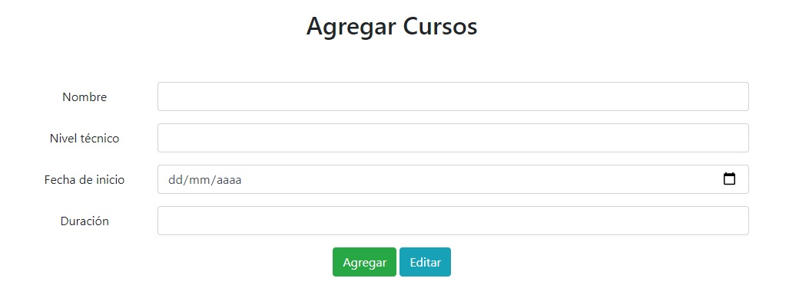
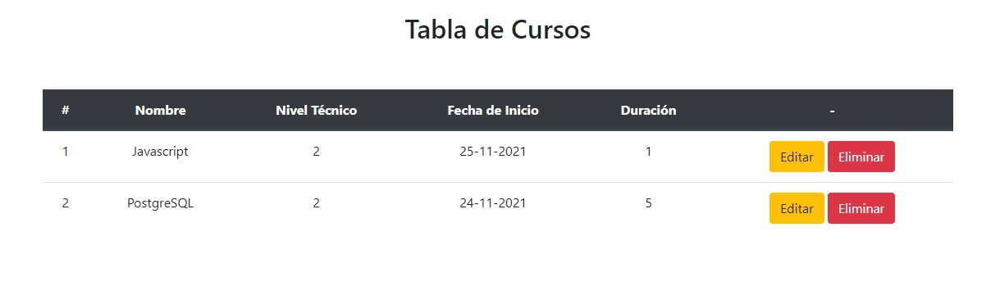

# Desafío - Gestión de Cursos

Desafío basado en:

- API REST
- POST (CREATE) & GET(READ)
- PUT (UPDATE) & DELETE (DELETE)

Crear una API REST con Express y el paquete pg para servir el backend de una aplicación tipo CRUD en el lado del cliente.

## Comenzando 🚀

_Estas instrucciones te permitirán obtener una copia del proyecto en funcionamiento en tu máquina local para propósitos de desarrollo y pruebas._

- $ git clone https://github.com/krakerbrain/desafio_gestion_de_cursos
- $ cd ../path/to/the/file
- $ npm install
- $ node server.js

### Requerimientos

1. Crear una ruta POST /curso que reciba un payload desde el cliente con los datos de
   un nuevo curso y los ingrese a la tabla cursos.
2. Crear una ruta GET /cursos que consulte y devuelva los registros almacenados en la
   tabla cursos.
3. Crear una ruta PUT /curso que reciba un payload desde el cliente con los datos de un
   curso ya existente y actualice su registro en la tabla cursos.
4. Crear una ruta DELETE /cursos que reciba el id de un curso como parámetro de la
   ruta y elimine el registro relacionado en la tabla cursos.

### Implementaciones adicionales

- En el index.html, línea 142, se agrega la s en la ruta porque la variable url declara la
  ruta curso sin(s) y el ejercicio pide la ruta "/cursos"
- Se implementa módulo Singleton para usar solo una instancia de pool
- En la función getCurso() del módulo consultas se usa la función "to_char" para convertir la fecha
  en un string que facilita su uso en las consultas

##### Las siguientes imágenes representan las interacciones que debe tener el sitio web una vez terminado el desafío.

###### Así debería verse el formulario

###### Así debería verse la tabla con los cursos agregados

## Construido con 🛠️

- [nodeJS](https://nodejs.org/en/)

#### Usando las librerías:

- [Express](https://expressjs.com/es/)
- [node pg](https://node-postgres.com/)

## Autores ✒️

- **Arlene Santos**
- **Eric Leiva**
- **Diego Madariaga**
- **Mario Montenegro**
